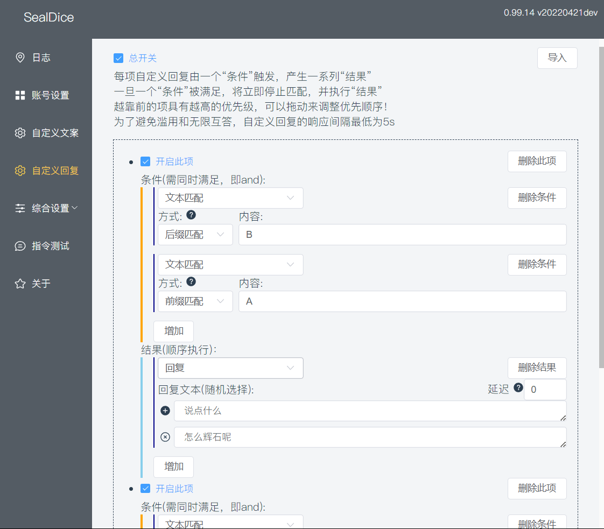
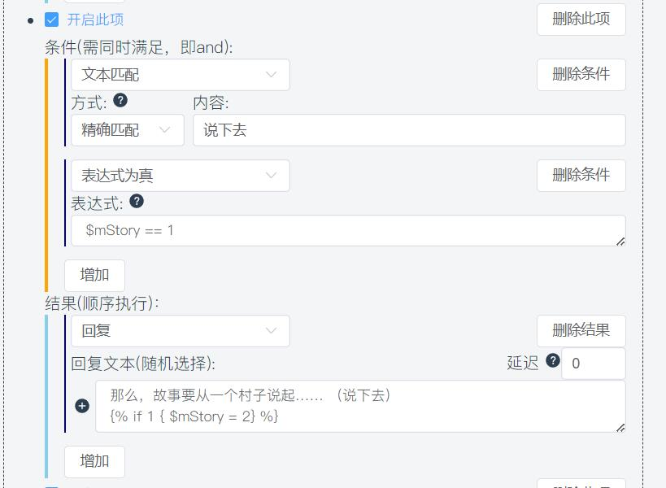
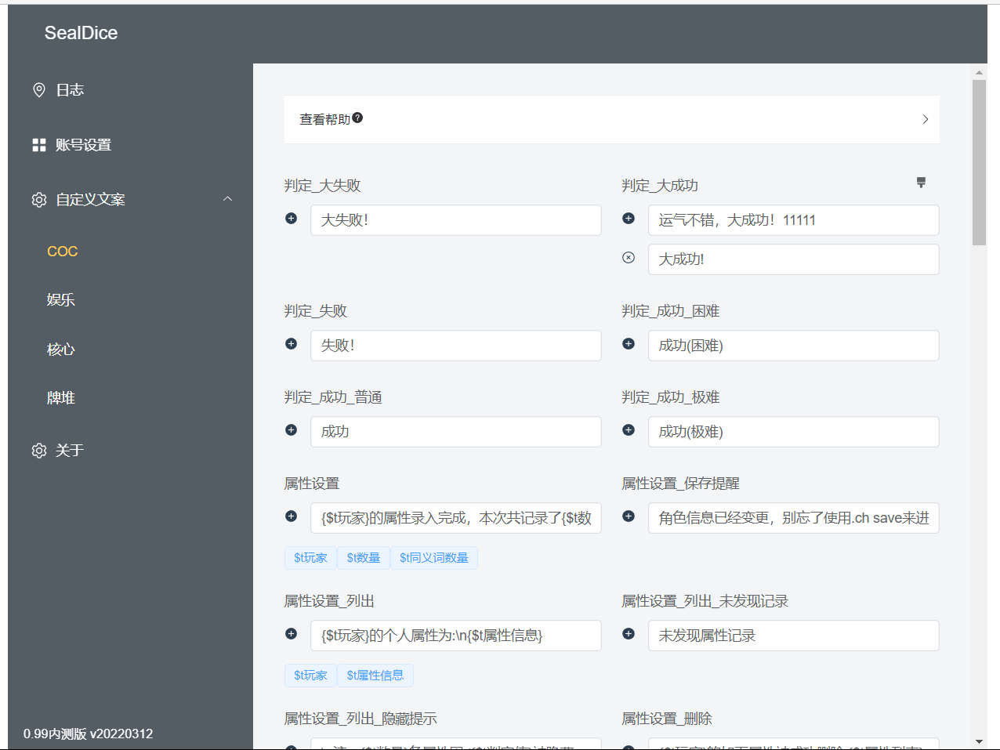
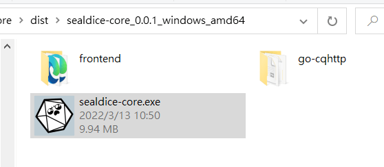
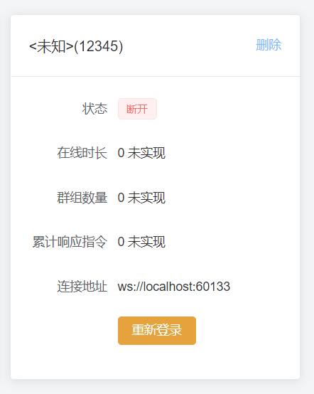

# SealDice: 指令手册


## 概述

一个简单易用的跑团骰子系统。

形象是海豹，可以被叫做**海豹骰、豹骰，豹子骰**之类。

[现在试试](https://dice.weizaima.com/) (官网首页，点在线试用)


特性：

* 点击运行，一键部署
* 非常友好的界面
* 与现有主流骰系极为相似的指令
* coc7 dnd5e fate指令支持
* 简单强大的自定义功能
* 牌堆等娱乐功能
* 极低的资源占用，程序包20MB，占用内存约30MB
* 支持Windows/Linux/macOS系统，x64和arm64架构
* 每12小时自动备份(间隔可调整)，也可以通过指令备份，不丢失任何数据！
* Golang编写


目前已经基本实现了主流骰子提供的指令，主要参考`ZhaoDice(赵骰)`、`Dice!(溯回系)`、`SinaNya(塔系)`三系骰子的手册和表现。

为了方便使用，默认随项目附带了`go-cqhttp`的二进制文件和许可协议。


### 快速跳转

[查看特色功能](#特色功能)

[搭建海豹核心](#如何使用(成为骰主))

[联系方式&官方群](#联系方式)

[骰子自定义](#骰子自定义)

[COC团使用](#COC玩家)

[DND团使用](#DND玩家)


本手册适用于0.99.14版本

最后更新: 2022-04-22

手册使用: [CC BY-NC-SA 4.0协议](https://creativecommons.org/licenses/by-nc-sa/4.0/)


## 提要

> 手册中的所有指令都将以标准格式书写，实际使用时宽松许多。
>
> 但适当空格是好习惯，不是吗？

本手册的指令使用这样的格式来进行介绍：

```
.指令 <参数A> <参数B> (参数C)
```

其中，`<>`括起来的内容代表”某个概念“，实际指令不需要加<>

而`()`括号括起来的内容代表这是一个可选参数

以骰点指令举例:

```
.r <表达式> (<原因>)
```

`<表达式>`是必填内容，譬如是d100，原因是可选内容

```
.r d100 高于50就打扫卫生
```

会得到这样的结果：

```
由于高于50就打扫卫生，<木落>掷出了 d100=[1d100=90]=90
```

接下来，本手册的指令示例都将以这种形式书写：

```
.r d100 高于50就打扫卫生  // 这部分是解说，不算在指令里
Dice: 由于高于50就打扫卫生，<木落>掷出了 d100=[1d100=90]=90
```

第一行为指令，第二行Dice:开头的代表骰子的回复，直到末尾。


### 阅览建议

强烈建议在阅读本文档时，展开左侧的目录


有些文档是面向骰主的，可以快速跳过自己不需要的章节。


### 常见问题 (FAQ)

#### > 和其他核心的不同之处

参见[特色功能](#特色功能)一节


#### > 为啥海豹不理我？

可能性一：私聊非好友

可能性二：遭到了风控发不出来。

可能性三：请检查当前开启的扩展，例如当coc7扩展关闭时，sc等指令是不会回应的。请运行`.ext coc7 on`开启对应扩展。

骰主可以后台查看骰子接收到的指令和反馈，风控也会提示。

另外骰主在海豹后台可以直接试指令。

如果确实是没反应！！请加入海豹群反馈！


#### > 可以关闭暗骰吗？

海豹不会去私聊非好友帐号，所以不必担心暗骰会影响帐号安全。


#### > 在服务器上登录时说“需要在同一WIFI下扫码”怎么办

有几种办法：

1. 使用密码登录，重试3次左右，有概率直接上号。

2. 本机上完成扫码登录，然后将登录过的配置文件覆盖到服务器上。

   具体目录是 **data/default/extra/go-cqhttp-qq12345**

   当然如果你没做过自定义配置，可以整个复制。

2. 让手机跟服务器真的处于同一个网络

   去这里下载socks5-tool工具，到国内服务器上运行

   https://sealdice.coding.net/public/sealdice/sealdice-tools/git/files

   在手机上使用你们熟悉的工具连接服务器，单次连接只持续15分钟。请尽快完成登录。


#### > @其他骰子做检定的时候，海豹也会回应，怎么办

首先更新到0.99.8以后的版本。

使用这个指令将其他骰子进行标记:

```
.botlist add @骰子A @骰子B
```

会有如下效果：

1. 当有人@该骰发指令，海豹不会做出回应
2. 该骰发出的指令和消息，海豹不会回应，这可以有效避免关键词触发的无限复读

之所以不保留传统@效果，是因为海豹基于@功能做了一项扩展，其适用场景远多于同群多骰。

具体可以参见文档的这一节：**ra/rc 指令 -> [对他人做检定](#对他人做检定)**


#### > 为啥好像反应慢一拍

其实指令计算是非常快的(可以在日志面板观察到)。

但是发送消息会有**随机延迟**，这是为了防止引起企鹅的警惕。

随机延迟间隔：0.4-0.9秒，可以在设置中调整


#### > 我希望在进群或者被踢出时候通知我

见界面的“综合设置-基本设置”

在“消息通知列表”中可以添加。目标可以是群，也可以是个人。

通知内容：加群邀请、好友邀请、进入群组、被踢出群、被禁言、自动激活、指令退群


#### > 支持QQ频道吗？
支持，邀请入频道后 @骰子 `.bot on` 即可开启。

默认不记录频道消息，也不自动开启(bot off状态)。

见“综合设置-基本设置”


#### > 怎么同时运行多个海豹？

对于第二只海豹，可以添加address参数启动，Windows上要额外带-m参数，例如:

```
sealdice-core --address=0.0.0.0:3212 -m
```

意为在3212端口上开启海豹。但是注意！**千万要把两个程序分成两个目录！！！**


#### > 能在手机上搭建吗？

可以使用termux运行arm64版本，但是我这里挺容易被杀后台。

闲置手机可以用来玩一下。

[在手机上运行(termux)](#在手机上运行(termux))

可能以后会出手机版本（是饼，但至少希望+1）


## 速通攻略(未完成)

如果你需要以PL身份参团，并快速掌握常用指令，可以遵循此节内容。

或者你是其他骰系的使用者，想要快速过一遍常用指令用法，这篇文档也适用于你。

当前内容以实际跑团过程为蓝本编写，适用于多数团。


### COC玩家

#### 1. 车卡录卡

临时创建人物/天命

```
.coc5

.st 力量70str70敏捷70dex70意志70pow70体质70con70外貌50app50教育70知识70edu70体型70siz70智力70灵感70int70san55san值55理智55理智值55幸运50运气50
```

载卡

```
.ch
```


#### 2. 骰点

```
.r 3d6*5
```


#### 3. 检定

```
.ra 聆听
.ra 幸运70
.ra 3#p射击
```

#### 4. 理智检定、掉血

```
.sc 0/1d4
.st hp-1d4
```


### DND玩家

待编写，目前请参阅[扩展-dnd5e](#扩展-dnd5e)一节


## 核心指令

`核心指令`是无法被关闭的指令。

与之相对的概念是`扩展指令`，扩展指令可以被关闭。

举例来说，输入`.ext coc7 off`关闭coc7扩展，那么相关的指令，例如`.st` `.sc` `.ra` `.setcoc`等就不会响应了。

关于扩展的概念，请阅读下方“扩展”一节


> 特别提醒：
>
> 你可能会觉得指令很复杂，但其实，现在的骰子就是如此，我自己也被需求的规模吓了一跳。
>
> 如果你很熟悉赵系、溯回系、塔系，特别是前两者，那么90%的内容是一样的！


###  .r 骰点

格式: `.r <表达式> (<原因>)`

别名: `.roll` `.rd`

可用范围: 群内、私聊


#### 常用示例

特别提醒一下，如果不写骰子算符(d/b/p，概念见下)，r指令相当于计算器

```
.r
Dice: <木落>掷出了 D100=69

.r d50
Dice: <木落>掷出了 d50=[1d50=48]=48

.r d50 天气不错
Dice: 由于天气不错，<木落>掷出了 d50=[1d50=4]=4

.r 5d24 骰5个24面骰
Dice: 由于骰5个24面骰，<木落>掷出了 5d24=[5d24=60, 7+20+15+1+17]=60

.r 4d6k3 骰4个6面骰，选3个最大的
Dice: 由于骰4个6面骰，选3个最大的，<木落>掷出了 4d6k3=[{6 5 3 | 1 }]=14

.r 100 + 3 * 2
Dice: <木落>掷出了 100 + 3 * 2=100 + 6=106
```


#### 奖励骰/惩罚骰

一类特殊的骰子，线下游戏时，D100是两个10面骰骰出来的，一个是个位，一个是十位。

如果十位骰为10，个位骰为1-9，那么结果是1-9（十位视为0）

如果两个10面骰都骰到10，那结果就是100

奖惩骰的机制是，多指定数量个十位骰，例如获得2个奖励骰，那么就丢3个十位骰。

假设十位骰结果是{4,5,8}，个位骰结果是2，那么最终结果就是42（取好的结果）

如果是惩罚骰，那么最终结果是82（取坏的结果）

```
.r b
Dice: <木落>掷出了 b=[D100=72, 奖励 4]=42

.r b3
Dice: <木落>掷出了 b3=[D100=96, 奖励 4 6 3]=36

.r p4 惩罚骰
Dice: 由于惩罚骰，<木落>掷出了 p4=[D100=87, 惩罚 5 7 8 7]=87
```


#### 多轮骰点

```
.r 4#d10
Dice:
<木落>掷骰4次:
d10=[1d10=9]=9
d10=[1d10=3]=3
d10=[1d10=7]=7
d10=[1d10=8]=8
```


#### DND5E优势骰劣势骰

```
.set 20
Dice:
设定默认骰子面数为 20
提示: 20面骰。如果要进行DND游戏，建议先执行.ext dnd5e on和.ext coc7 off以避免指令冲突

.r d20优势
Dice: <木落>掷出了 d20优势=[{7 | 6 }]=7

.r d劣势
<木落>掷出了 d劣势=[{16 | 18 }]=16
```

d20优势 = 2d20k1，即2个d20取结果高的一个

d20劣势 = 2d20q1，即2个d20取结果低的一个


#### fvtt骰点兼容

```
.r d20kh  // 优势骰
<木落>掷出了 d20kh=[{10 | 3 }]=10

.r d20kl  // 劣势骰
<木落>掷出了 d20kl=[{6 | 15 }]=6

.r 4d6dl1 // 丢4排除1个最低值
<木落>掷出了 4d6dl1=[{5 3 2 | 1 }]=10

.r 4d6dh1 // 丢4排除1个最高值
<木落>掷出了 4d6dh1=[{3 3 5 | 6 }]=11
```


#### fate 命运骰

一种特殊的六面骰，六个面分别为 - - 0 0 + +，分别代表-1 0 1

骰点时投掷4次，加在一起为结果。例如某次结果是[-+++]，为-1 + 1 + 1 + 1 = 2

```
.r f
Dice: <木落>掷出了 f=[---+]=-2
```

带补正的情况:

````
.r f+1
<木落>掷出了 f+1=0[+0-0] + 1=1
````


#### 混合运算

```
.r 30 + (-1d20) + 49
Dice: <木落>掷出了 30 + (-1d20) + 49=30 + -1[1d20=1] + 49=78

.r d50 * 3 + 2
Dice: <木落>掷出了 d50 * 3 + 2=21[1d50=21] * 3 + 2=65

.r d50 * 3 + (2 - p2) 多项式
Dice: 由于多项式，<木落>掷出了 d50 * 3 + (2 - p2)=25[1d50=25] * 3 + -64[D100=6, 惩罚 6 5]=11
```


事实上，海豹核心支持了这些算符：

**常用数学算符:** 加减乘除(+-*/)、乘方(**)、括号

**骰子算符:** 多面骰(d, <次数>d<面数>(k<个数>)(q<个数>))，奖励骰(b, b<个数>)、惩罚骰(p, p<个数>)


用字母表示的骰子算符有些反直觉，其实它们和加减乘除是一样的：

```
.r 1d1d1d1d1d1d1d1d1d1d1d1d1d1d(20+1d3*4)
Dice: <木落>掷出了 1d1d1d1d1d1d1d1d1d1d1d1d1d1d(20+1d3*4)=13

.r 1d10+(1+32)d(4*6)d20
Dice: <木落>掷出了 1d10+(1+32)d(4*6)d20=1[1d10=1] + 3941[33d24=384,384d20=3941]=3942
```


### .rh 暗骰

格式: `.rh <表达式> (<原因>)`

别名: `.rhd`

可用范围: 群内


这个指令的格式与`.r`完全相同，只不过效果是在群里撂下一句提示，然后把骰点结果私聊发给你。

不过注意！由于企鹅的严打，陌生人私聊极其容易触发风控，所以私聊发送只会发给好友。如果你不是骰子的好友，看不到任何结果。


```
// 群内
.rh d50
Dice: 命运正在低语！

// 私聊
Dice:
来自群<某个无聊团>(123)的暗骰:
<木落>掷出了 d10=[1d10=3]=3
```


### .rx / .rxh 特殊骰点

格式: `.rx <表达式> (<原因>)`

别名: 无

可用范围: 群内、私聊


**这个指令一般跑团可以不用看了。**

它主要和`表达式`是否允许读取变量有关。举个例子：

```
.r 聆听
Dice: 由于聆听，<折影>掷出了 D100=54

.rx 聆听
Dice: <木落>掷出了 聆听=[聆听=60]=60

.rx 聆听+d10
Dice: <木落>掷出了 聆听=[聆听=60] + 8[1d10=8]=68

.rx 侦查+1d20**2
Dice: <木落>掷出了 侦查+1d20**2=75[侦查=75] + 324[1d20=18]=399

.rx d(侦查)
Dice: <木落>掷出了 d(侦查)=[侦查=60,1d60=52]=52
```


### .bot 骰子管理

格式: `.bot on/off/bye/about`

别名: 无

可用范围: 群内、私聊


较为简单的指令，直接看例子：

```
.bot on // 开启
Dice: <海豹bot> 已启用 SealDice 0.99内测版 v20220312

.bot off // 关闭
Dice: <海豹bot> 停止服务

.bot bye // 退群
Dice: 收到指令，5s后将退出当前群组

.bot // 或者 .bot about
Dice: SealDice 0.99内测版 v20220312
供职于8个群，其中3个处于开启状态
上次自动保存时间: 2022-03-13 04:57:55 UTC
群内工作状态: 开启
```


### .nn 角色名设定

格式: `.nn (<角色名>)`

别名: 无

可用范围: 群内


若有角色名参数，则进行设定。若无角色名，重置回默认名字。

```
.nn 简·拉基·茨德
Dice: <木落>()的昵称被设定为<简·拉基·茨德>

.r
Dice: <简·拉基·茨德>掷出了 D100=16

.nn
Dice: <木落>(303451945)的昵称已重置为<木落>
```


### .set 设定骰子面数

格式: `.set` // 查看当前面数设置

格式: `.set <面数>` // 设定群内骰子面数

格式: `.set <面数> --my` // 设定个人专属骰子面数

格式: `.set clr` // 清除群内骰子面数设置

格式: `.set clr --my` // 清除个人骰子面数设置

别名: 无

可用范围: 群内、私聊


```
.set 20
Dice: 设定默认骰子面数为 20

.set
个人骰子面数: 0
群组骰子面数: 20
当前骰子面数: 20
```


设定骰子面数，默认值是100

优先级: **个人 > 群 > 默认(100)**


### .ch 角色卡管理

格式: `.ch save/load/list/del`

别名: `.pc` `.角色`

可用范围: 群内


.ch save (<角色名>) // 保存角色，角色名省略则为当前昵称

.ch load (<角色名>) // 加载角色，角色名省略则为当前昵称

.ch list // 列出当前角色

.ch del <角色名> // 删除角色

.ch help 显示帮助


### .find/.查询 查询指令

格式: `.find <关键字>` // 关键字可以多个，用空格分割

格式: `.find <数字ID>` // 显示该ID的词条

格式: `.find --rand` // 显示随机词条

别名: `.查询`

可用范围: 群内、私聊


海豹搭载了两个查询核心:

* 全文搜索 - 提供强大的索引功能，能够查询文档内容中的关键字，**但只能支持x86设备**。文档多的话会拖慢启动速度。
* 快速文档查找 - 只在标题中进行查找，速度很快。用于性能/内存受限的场景，以及手机端。


#### 全文搜索！

来看看全文搜索吧，它非常强大，这是搭载了DicePP（梨骰）项目整理的查询资料后的效果：

```
.查询 30尺 法术

Dice:
全部结果:
[序号3066]【术士:超魔法:远程法术】 匹配度 0.16
[序号3015]【游侠:驯兽师:法术共享】 匹配度 0.13
[序号2396]【法术详述:迷踪步】 匹配度 0.12
[序号1319]【法术详述:阿迦纳萨喷火术】 匹配度 0.12
[序号507]【法术详述:智能堡垒/智力堡垒/智慧堡垒/智能壁垒/心智堡垒/心智壁垒】 匹配度 0.12
[序号2514]【法术详述:水下呼吸/水中呼吸】 匹配度 0.11
[序号2212]【法术详述:原力法阵】 匹配度 0.11
[序号1403]【法术详述:众星冠冕/星辰冠冕/星之冠冕】 匹配度 0.11
[序号2243]【法术详述:造水/枯水术/造水术/枯水术】 匹配度 0.11
[序号2176]【法术详述:秘法眼】 匹配度 0.11

(本次搜索由全文搜索完成)
```

因为多个文本匹配度相近，因此没有列出最佳匹配条目的正文内容。用这条指令可以查看：

```
.查询 2212
Dice:
词条: 法术详述:原力法阵
原力法阵 Circle of Power
圣武士
5环 防护
施法时间：1动作
施法距离：自身（30尺半径）
法术成分：V
持续时间：专注，至多10分钟
你身上发出神圣能量并以扭曲散溢的魔法能量构成一个半径30尺的球状力场。法术持续时间内力场将以你为中心随你移动。力场范围内的友方生物（包括你自己）为对抗法术或其他魔法效应而进行的豁免检定具有优势。此外，受本法术效应影响的生物在对抗豁免成功则伤害减半的法术或魔法效应时，若成功则不受伤害。
```

**这么好用，那代价是什么呢？**

更多的内存占用。变慢的启动速度。

给个参考：搭载了怪物之锤文本，以及梨骰DND查询包之后，海豹核心占据了80MB内存。

大致可以这样换算：**每1MB文本占15MB内存**


#### 快速文档查找

指令是一样的，因此善乏可陈。

示例如下：

```
.find 测试词条
dice:
最优先结果:
词条: 测试:测试词条
他在命运的沉浮中随波逐流, 扮演着受害与加害者的双重角色

全部结果:
[序号2]【测试:测试词条】 匹配度 67.00

(本次搜索由快速文档查找完成)
```


#### 致谢

默认搭载的两个示例文档：

其中《怪物之锤查询》的整理者为：**蜜瓜包**和**October**

DND系列资料的整理者主要为DicePP项目组成员，包括**Farevell**、**梨子**、**花作噫**、**邪恶**、**惠惠**、**赵小安**等

这些资料的原始出处和译者很多已经不可考，此处无法一一列出，甚为遗憾。

也在此感谢一代又一代无名作者和译者做出的工作。


### .help 帮助指令

格式: `.help (<词条名>)`

格式: `.help reload` // 重新装载帮助文档，仅master可用

别名: 无

可用范围: 群内、私聊


显示帮助


### .botlist 机器人列表

格式: `.botlist add @A @B @C` // 标记群内其他机器人，以免发生误触和无限对话

格式: `.botlist add @A @B --s` // 同上，不过骰子不会做出回复

格式: `.botlist del @A @B @C` // 去除机器人标记

格式: `.botlist list` // 查看当前列表

别名: 无

可用范围: 群内


这个指令用于标记群内的其他骰子或娱乐机器人，以便于各司其职。

被标记后会有如下效果：

1. 当有人@该骰发指令，海豹不会做出回应
2. 该骰发出的指令和消息，海豹不会回应，这可以有效避免关键词触发的无限复读

之所以不保留传统@效果，是因为海豹基于@功能做了一项扩展，其适用场景远多于同群多骰。

具体可以参见文档的这一节：**ra/rc 指令 -> [对他人做检定](#对他人做检定)**


示例:

```
.botlist add @某公骰
Dice:
新增标记了1个帐号，这些账号将被视为机器人。
因此别人@他们时，海豹将不会回复。
他们的指令也会被海豹忽略，避免发生循环回复事故
```

此外，被标记的当事人可以发出指令解除自己的标记。


### .ext 扩展管理

格式: `.ext <扩展名> on/off`  //开关

格式: `.ext <扩展名>` // 查看信息

格式:`.ext list`  // 查看扩展列表

可用范围: 群内


海豹除了核心指令之外，都被设计为可插拔的，目前有7个内置扩展。

关闭对应扩展会连同扩展带来的指令一块关闭。

注意！每个群可以分别开启不同的扩展。

```
.ext
Dice:
检测到以下扩展：
1. [开]coc7 - 版本:1.0.0 作者:木落
2. [开]log - 版本:1.0.0 作者:木落
3. [开]fun - 版本:1.0.0 作者:木落
4. [开]deck - 版本:1.0.0 作者:木落
5. [关]reply - 版本:1.0.0 作者:木落
6. [开]dnd5e - 版本:1.0.0 作者:木落
7. [开]story - 版本:1.0.0 作者:木落
使用命令: .ext <扩展名> on/off 可以在当前群开启或关闭某扩展。
命令: .ext <扩展名> 可以查看扩展介绍及帮助


.ext coc7 on
Dice: 打开扩展 coc7

.ext reply
Dice:
> [reply] 版本1.0.0 作者木落
> [尚未实现]智能回复模块，支持关键字精确匹配和模糊匹配
提供命令:
.reply


.ext reply off
Dice: 关闭扩展 reply
```

开启或关闭扩展能够直接改变骰子响应的命令。

例如coc7扩展提供了`.coc` /`.st` / `.ra` / `.rc` / `.sc` / `.setcoc` / `.ti` / `.li`一系列指令。

而dnd5e扩展提供`.st` `.rc` `.ri`

扩展关闭后，这些指令也会失效，可以有效避免指令混淆（**每个群都可以启用不同的扩展**）

例如我在A群打开`coc7`和`deck`两个扩展，B群可以只开启`deck`扩展，等等。

未来将制作更多官方扩展，以及提供自定义扩展脚本接口。


### .master 骰主指令

格式: `.master add me` // 将自己标记为骰主

格式: `.master add @A @B` // 将别人标记为骰主

格式: `.master del @A @B @C` // 去除骰主标记

格式: `.master unlock <密码(在UI中查看)>` // (当Master被人抢占时)清空骰主列表，并使自己成为骰主

格式: `.master list` // 查看当前骰主列表

格式: `.master relogin` // 30s后重新登录，有机会清掉风控(仅master可用)

格式: `.master list` // 查看当前骰主列表

格式: `.master reboot` // 重新启动(需要二次确认)

格式: `.master checkupdate` // 检查更新(需要二次确认)

别名: 无

可用范围: 群内、私聊

补充：这条指令做了@排除，如果存在@，且自己没有被@，不作回应。


对于一个无主骰，任何人都可以进行标记。

一旦有人成为骰主，此命令将只有骰主可以使用。

所有骰主都可以踢掉其他骰主，包括自己在内。

骰子的真正所有者，可以从后台看到解锁口令，来通过`.master unlock`命令直接取得骰主权限。


### .send 对骰主留言

格式: `.send <想说的话>`

别名: 无

可用范围: 群内、私聊

补充：这条指令做了@排除，如果存在@，且自己没有被@，不作回应。


给骰主留言吧！

不过首先，必须存在一名骰主，正如必须有一个巫妖王。

除了留言之外，骰主将看到你的名字和帐号。

如果是群内留言，还将看到群名和群号。


### .text 自定义文本命令 

格式: `.text <文本表达式>`

别名: 无

可用范围: 群内、私聊


这个命令的使用方式很简单：

```
.text Hello World!
Dice: Hello World!
```

它支持变量，比如有一些内置变量（角色属性也是变量）：

```
.text Hello {$t玩家}，你的理智属性为{san}
Dice: Hello <木落>，你的理智属性为50
```

还可以做赋值操作，例如

```
.text 你直面了未知。扣除理智{$tSan=1d10}，理智变化: {san} ➯ {san=san-$tSan}
Dice: 你直面了未知。扣除理智5，理智变化: 50 ➯ 45
```

一个较为复杂的例子，coc7角色做成：

```
.text 力量:{$t1=3d6*5} 敏捷:{$t2=3d6*5} 意志:{$t3=3d6*5} 体质:{$t4=3d6*5} 外貌:{$t5=3d6*5} 教育:{$t6=(2d6+6)*5} 体型:{$t7=(2d6+6)*5} 智力:{$t8=(2d6+6)*5} 幸运:{$t9=3d6*5} 生命值:{($t4+$t7)/10} 总数:{$t1+$t2+$t3+$t4+$t5+$t6+$t7+$t8}
Dice: 力量:40 敏捷:65 意志:60 体质:55 外貌:30 教育:65 体型:50 智力:40 幸运:30 生命值:10 总数:405
注: .coc命令内部也是如此实现
```

你可能注意到了有的变量带`$t`前缀，这是“临时变量”的意思。

想了解更多关于变量，见“变量机制”一节


### .welcome 自定义文本命令 

11


## 扩展: coc7


### .coc 制卡指令

格式: `.coc (<数量>)` // 制卡指令，返回<数量>组人物属性

别名: 无

可用范围: 群内、私聊


```
.coc 3
Dice:
<木落>的七版COC人物作成:
力量:40 敏捷:80 意志:30
体质:80 外貌:50 教育:45
体型:55 智力:60
HP:13 幸运:50 [440/490]

力量:55 敏捷:75 意志:45
体质:30 外貌:65 教育:60
体型:65 智力:50
HP:9 幸运:25 [445/470]

力量:45 敏捷:55 意志:50
体质:55 外貌:60 教育:85
体型:50 智力:55
HP:10 幸运:60 [455/515]
```


### .en 技能成长

格式: `.en <技能名称>(技能点数) (+(<失败成长值>/)<成功成长值>)` // 整体格式，可以直接看下面几个分解格式

格式: `.en <技能名称>` // 骰D100，若点数大于当前值，属性成长1d10

格式: `.en <技能名称>(技能点数)` // 骰D100，若点数大于`技能点数`，属性=技能点数+1d10

格式: `.en <技能名称>(技能点数) +<成功成长值>` // 骰D100，若点数大于当前值，属性成长`成功成长值`点

格式: `.en <技能名称>(技能点数) +<失败成长值>/<成功成长值>` // 骰D100，若点数大于当前值，属性成长`成功成长值`点，否则增加`失败成长值`点

别名: 无

可用范围: 群内

```
.en 侦查
Dice:
<木落>的“侦查”成长检定：
D100=68/66 成功
“侦查”增加了1d10=3点，当前为69点
角色信息已经变更，别忘了使用.ch save来进行保存！

// 以下例子省略掉骰子的回复
.en 侦查30
.en 侦查 +1d20 // 若成功，成长1d20
.en 侦查 +1d5/1d10

.en 侦查 +-1d5/1d10
.en 侦查 +(-1d5)/1d10 // 跟上一句相同，带括号容易理解一点
```


### .st 属性设置

格式: `.st`

别名: 无

可用范围: 群内

.st show // 展示个人属性
.st show <属性1> <属性2> ... // 展示特定的属性数值
.st show <数字> // 展示高于<数字>的属性，如.st show 30
.st clr/clear // 清除属性
.st del <属性1> <属性2> ... // 删除属性，可多项，以空格间隔
.st help // 帮助
.st <属性><值> // 例：.st 敏捷50
.st <属性>±<表达式> // 例：.st 敏捷+1d50，请注意目前+或-要跟在属性后面，不得空格

（待补完）


### .ra/rc 技能检定

格式: `.ra/rc <属性表达式> (@某人)`

格式: `.ra <难度><属性> (@某人)` // 如 .ra 困难侦查

格式: `.ra b <属性表达式> (@某人)` // 奖励骰或惩罚骰

格式: `.ra p <属性表达式> (@某人)` // 奖励骰或惩罚骰

格式: `.ra b<数字或括号> <属性表达式> (@某人)`

别名: 无

可用范围: 群内


属性检定指令，当<检定表达式>算出的值小于等于<属性表达式>，如计算 D100 < 聆听，

若小于等于，则检定通过。当@某人时对此人做检定。

rc是规则书检定。而ra是房规检定。

区别主要在于对大成功/大失败的判定方式。

当`.setcoc 0`时，ra和rc等价。

可以使用类似多轮骰点的多轮检定。


#### 举例

```
.ra 聆听
Dice: <木落>的聆听检定结果为: d100=59/76, ([1d100=59]) 成功

.ra 困难侦查
Dice: <折影>的困难侦查检定结果为: D100=7/12 成功了！这要费点力气

.ra b 射击
Dice: <木落>的射击检定结果为: b=60/60, ([D100=60, 奖励 0]) 成功

.ra 3# b 射击
Dice: 
<木落>的射击进行了3次检定，结果为:
b=17/60, ([D100=17, 奖励 1]) 成功(极难)
b=32/60, ([D100=92, 奖励 3]) 成功
b=49/60, ([D100=49, 奖励 6]) 成功

// 其实指令可以连写，不过不是很建议，例如这样的写法(溯洄骰)
.ra3#b射击
// 也支持这样的写法(赵骰)
.rab3#射击

他们都与上面的写法等价
```


#### 对他人做检定

如果kp/dm希望对某人做检定，可以检定时@对方，同时适用于暗中检定。

```
.ra 侦查 @猛男
Dice: <猛男>的侦查检定结果为: d100=95/55, ([1d100=95]) 失败！

.ra 侦查 // 不@是自己
Dice: <木落>的侦查检定结果为: d100=48/88, ([1d100=48]) 成功
```


### .rah/rch 暗中检定

格式: `.rah/rch <属性表达式> (@某人)`

别名: 无

可用范围: 群内


与.ra/.rc完全相同，只不过会将结果私聊发送


### .rav/rcv 对抗检定

格式: `.rav/.rcv <技能> (@某人)` // 自己和某人进行对抗检定

格式: `.rav <技能1> <技能2> @某A @某B` // 对A和B两人做对抗检定，分别使用输入的两个技能数值

别名: 无

可用范围: 群内


<技能>写法举例: 侦查、侦查40、困难侦查、40、侦查+10


**请注意，海豹核心的rav指令是不需要后手确认的，相当于面团中RP说明行为后，再骰对抗。这与塔系rav指令不同**

一段典型(雾)用法：

```
Alice: 唔，劲啊！可我今日注定将你轰杀至渣啊！吃我一拳，Bob!
KP: Bob，Alice要打你，你要反击还是躲避？
Bob: 呵，汝今日便要葬在这里呀！反击！给我败罢！
Alice: .rav 斗殴 @Bob

Dice:
对抗检定:
<Alice> 40-> 属性值:40 判定值:36 成功
<Bob> 20-> 属性值:20 判定值:34 失败
<Alice>胜利！
```


这里给出一些详细的用法示例：

```
.rav/.rcv 技能 @某人 // 自己和某人进行对抗检定

.rav 技能,b1 @某人 // 同上，我方有一个奖励骰 

.rav 困难技能60 @某人 // 同上，但是困难等级，技能值60。

.rav 困难技能+10 @某人 // 同上，但是有10的加成。

.rav 技能 @某A @某B // 对A和B两人做对抗检定

.rav 技能 技能 @某A @某B // 对A和B两人做对抗检定，分别使用输入的两个技能数值

.rav 技能 困难技能 @某A @某B // 同上，带难度

.rav 技能,b1 困难技能 @某A @某B // 同上，A带一个奖励骰

.rav 60 40 @某A @某B // 最简化版本，A的60点对抗B的40点
```


### .sc 理智检定

格式: `.sc <成功时掉san>/<失败时掉san>`

格式: `.sc <失败时掉san>`

格式: `.sc b <成功时掉san>/<失败时掉san>`

别名: 无

可用范围: 群内


对理智进行一次D100检定，根据结果扣除理智。

如“.sc 0/1d3”为成功不扣除理智，失败扣除1d3。大失败时按掷骰最大值扣除。

支持复杂表达式。如.sc 1d2+3/1d(知识+1)

大成功/大失败判定遵循房规。


### .setcoc 设置房规

格式: `.setcoc 0-5`

别名: 无

可用范围: 群内


| 序号    | 规则                                                         |
| ------- | ------------------------------------------------------------ |
| 0[默认] | 出1大成功，不满50出96-100大失败，满50出100大失败(COC7规则书) |
| 1       | 不满50出1大成功，不满50出96-100大失败，满50出100大失败       |
| 2[常用] | 出1-5且判定成功为大成功，出96-100且判定失败为大失败          |
| 3       | 出1-5大成功，出96-100大失败(即大成功/大失败时无视判定结果)   |
| 4       | 出1-5且≤(成功率/10)为大成功，不满50出>=96+(成功率/10)为大失败，满50出100大失败 |
| 5       | 出1-2且≤(成功率/5)为大成功，不满50出96-100大失败，满50出99-100大失败 |


### .ti 抽取临时性疯狂症状

格式: `.ti`

别名: 无

可用范围: 群内

```
.ti
<木落>的疯狂发作-即时症状:
1D10=8
竭嘶底里：调查员表现出大笑，哭泣，嘶吼，害怕等的极端情绪表现，持续 1D10=10 轮。
```


### .li 抽取总结性疯狂症状

格式: `.li`

别名: 无

可用范围: 群内

```
.li
<木落>的疯狂发作-总结症状:
1D10=8
逃避行为：调查员恢复清醒时发现自己在很远的地方，也许迷失在荒郊野岭，或是在驶向远方的列车或长途汽车上。
```


## 扩展: dnd5e

注: dnd5e指令暂时无法在私聊中使用。这是因为扩展指令`.ext`暂时不能在私聊中使用，所以无法在私聊中开启dnd5e扩展。


### .dnd 制卡指令

格式: `.dnd (<数量>)` // 制卡指令，返回<数量>组人物属性，最高为10次

格式: `.dndx (<数量>)` // 制卡指令，但带有属性名，最高为10次

别名: 无

可用范围: 群内、私聊


自由分配模式:

```
.dnd 5
Dice:
<木落>的DnD5e人物作成(自由分配模式):
[16, 16, 14, 11, 10, 9] = 76
[16, 15, 15, 12, 9, 9] = 76
[16, 15, 14, 13, 13, 12] = 83
[18, 17, 15, 14, 13, 8] = 85
[15, 14, 13, 13, 10, 8] = 73
获取带属性名的预设请用.dndx
```
预设模式:

```
.dndx 5
<木落>的DnD5e人物作成(预设模式):
力量:16 体质:9 敏捷:14 智力:10 感知:13 魅力:10 共计:72
力量:13 体质:12 敏捷:8 智力:8 感知:14 魅力:9 共计:64
力量:16 体质:10 敏捷:11 智力:14 感知:12 魅力:10 共计:73
力量:9 体质:17 敏捷:15 智力:9 感知:10 魅力:13 共计:73
力量:12 体质:6 敏捷:8 智力:13 感知:10 魅力:8 共计:57
自由分配模式请用.dnd
```


### .ri 先攻设置

格式: `.ri <先攻值> <角色名>` // 角色名省略为当前角色

格式: `.ri +2 <角色名>` // 先攻值格式1，解析为D20+2

格式: `.ri 12 <角色名>` // 先攻值格式2，解析为12

格式: `.ri =D20+3 <角色名>` // 先攻值格式3，解析为D20+3

格式: `.ri <单项>, <单项>, ...` // 允许连写，逗号分隔

别名: 无

可用范围: 群内


先攻

```
// 单独设置
.ri +2 // 为自己设定
.ri +3 狗头人1 // D20加值方式
.ri =D20+2 狗头人1 // 表达式方式
.ri 30 狗头人1  // 数值方式


// 批量设置
.ri +2 狗头人1, 3 狗头人2, =d30 狗头人3 +3
Dice:
先攻点数设置: 
 1. 狗头人1: 10[1d20=10] + 2=12
 2. 狗头人2: 3
 3. 狗头人3: 1
 4. 木落: 1[1d20=1] + 3=4

```


### .init 先攻列表

格式: `.init` // 查看先攻列表

格式: `.init del <单位1> <单位2> ...` // 从先攻列表中删除

格式: `.init set <单位名称> <先攻表达式>` // 设置单位的先攻

格式: `.init clr` // 清除先攻列表

格式: `.init help` // 显示本帮助

别名: 无

可用范围: 群内


```
// 设置先攻
.ri +2 狗头人1, 4 狗头人2, 12 木落
Dice:
先攻点数设置: 
 1. 狗头人1: 8[1d20=8] + 2=10
 2. 狗头人2: 4
 3. 木落: 12

// 查看列表
.init
Dice:
当前先攻列表为:
 1. 木落: 12
 2. 狗头人2: 10
 3. 狗头人1: 4
```


### .st DND属性设置

格式: `.st 模板` // 录卡模板

格式: `.st show` // 展示个人属性

格式: `.st show <属性1> <属性2> ...` // 展示特定的属性数值

格式: `.st show <数字>` // 展示高于<数字>的属性，如.st show 30

格式: `.st clr/clear` // 清除属性

格式: `.st del <属性1> <属性2> ...` // 删除属性，可多项，以空格间隔

格式: `.st export` // 导出，包括属性和法术位

格式: `.st help` // 帮助

格式: `.st <属性>:<值>` // 设置属性，技能加值会自动计算。例：.st 感知:20 洞悉:3

格式: `.st <属性>±<表达式>` // 例：.st 生命+1d4

格式: `.st hp-1d6 --over` // 不计算临时生命扣血

别名: `.dst`

可用范围: 群内


DND的录卡，和属性操作指令。

这个指令最好在关闭COC扩展时使用，如果一起用，可以使用`.dst`来规避指令冲突。

目前支持技能调整值的自动计算，包括属性带来的加值，和熟练带来的加值。


使用模板录卡:

```
// 查看模板
.st 模板
Dice:
人物卡模板(第二行文本):
.dst 力量:10 体质:10 敏捷:10 智力:10 感知:10 魅力:10 hp:10 hpmax: 10 熟练:2 运动:0 特技:0 巧手:0 隐匿:0 调查:0 奥秘:0 历史:0 自然:0 宗教:0 察觉:0 洞悉:0 驯养:0 医疗:0 生存:0 说服:0 欺诈:0 威吓:0 表演:0
注意: 技能只填写修正值即可，属性调整值会自动计算。熟练写为“运动*:0”

// 录卡
.st 力量:12 体质:10 敏捷:10 智力:10 感知:10 魅力:10 hp:10 hpmax: 10 熟练:2 运动*:3 特技:1 巧手:0 隐匿:0 调查:0 奥秘:0 历史:0 自然:0 宗教:0 察觉:0 洞悉:0 驯养:0 医疗:0 生存:0 说服:0 欺诈:0 威吓:0 表演:0
Dice:
<木落>的dnd5e人物属性设置如下:
读入: 力量:12, 体质:10, 敏捷:10, 智力:10, 感知:10, 魅力:10, hp:10, hpmax:10, 熟练:2, 运动:3[技能, 熟练], 特技:1[技能], 巧手:0[技能], 隐匿:0[技能], 调查:0[技能], 奥秘:0[技能], 历史:0[技能], 自然:0[技能], 宗教:0[技能], 察觉:0[技能], 洞悉:0[技能], 驯养:0[技能], 医疗:0[技能], 生存:0[技能], 说服:0[技能], 欺诈:0[技能], 威吓:0[技能], 表演:0[技能]
```

查看

```
.st show // 查看属性
<木落>的个人属性为:
力量: 12	敏捷: 10	体质: 10	智力: 10	
感知: 10	魅力: 10	hp: 10	hpmax: 10	
EXP: 0	熟练: 2	特技: 1[基础值1]	运动: 6[基础值3]	
... // 还有一堆 这里不写了

// 如果想查看部分，使用
.st show 力量 运动 熟练
<木落>的个人属性为:
力量: 12	熟练: 2	运动: 6[基础值3]

```

修改属性

```
.st 力量 + 2
Dice:
人物属性设置如下:
修改: 力量(12 ➯ 14)
```

属性修改后，属性调整值会自动变更。不用再行关注。


**退游小技巧，黑暗录卡:**

```
.st 力量:4d6k3 体质:4d6k3 敏捷:4d6k3 智力:4d6k3 感知:4d6k3 魅力:4d6k3 hp:10 hpmax: 10 熟练:2 运动:0 特技:0 巧手:0 隐匿:0 调查:0 奥秘:0 历史:0 自然:0 宗教:0 察觉:0 洞悉:0 驯养:0 医疗:0 生存:0 说服:0 欺诈:0 威吓:0 表演:0
```


对生命值的特殊支持：

- 当存在临时生命(buff血量)，自动优先消耗。若临时生命不足以抵挡伤害，剩余会扣减血量
- 当生命值归零，若伤害大于等于血量上限，判定人物死亡
- 当生命值归零，若伤害小于血量上限，人物昏迷
- 当人物已经昏迷，不足致死的伤害自动折算为死亡豁免失败


一次性进行多个修改：

```
.st hp-3 hp-3 hp-3
<木落>的dnd5e人物属性设置如下:
修改: hp(2 ➯ 0), hp(0 ➯ 0), hp(0 ➯ 0)
<木落>遭受了1点过量伤害，生命值降至0，陷入了昏迷！
<木落>在昏迷状态下遭受了3点过量伤害，死亡豁免失败+1！
<木落>在昏迷状态下遭受了3点过量伤害，死亡豁免失败+1！
```


此外，这个指令可以通过@来选定其他人（仅限一名），调整对方的属性。

特别注意：**.st clr会同时清除法术位**


### .rc DND检定

格式: `.rc <属性>` // .rc 力量

格式: `.rc <属性>豁免` // .rc 力量豁免

格式: `.rc <表达式>` // .rc 力量+3

格式: `.rc 优势 <表达式>` // .rc 优势 力量+4

格式: `.rc 劣势 <表达式> (原因)` // .rc 劣势 力量+4 推一下试试

格式: `.rc <表达式> @某人` // 对某人做检定

别名: `.drc`

可用范围: 群内


示例

```
.rc 运动
Dice:
<木落>的“运动”检定结果为:
8[1d20=8] + 6[运动=6] = 14
```


优势检定和劣势检定

```
.rc 优势 力量+4
Dice:
<木落>的“力量+4”检定结果为:
17[{17 | 11 }] + 12[力量=12] + 4 = 33
```

带原因的检定:

```
.rc 劣势 力量+4 推一下试试
Dice:
<木落>的“推一下试试”检定结果为:
17[{17 | 18 }] + 12[力量=12] + 4 = 33
```

此外，这个指令可以通过@来选定其他人（仅限一名）操作。


### .buff DND临时属性

格式: `.buff` // 展示当前buff

格式: `.buff clr` // 清除buff

格式: `.buff del <属性1> <属性2> ...` // 删除属性，可多项，以空格间隔

格式: `.buff help` // 帮助

格式: `.buff <属性>:<值>` // 设置buff属性，例：.buff 力量:4  奥秘*:0，奥秘临时熟练加成

格式: `.buff <属性>±<表达式>` // 修改属性，例：.buff hp+1d4

格式: `.buff <属性>±<表达式> @某人` // 修改他人buff属性，例：.buff hp+1d4

别名: `.dbuff`

可用范围: 群内


目前这个指令的行为和st指令基本一致。

用于设置临时属性，例如虚假生命：

```
.st hp:10
.buff hp : 1d4+4

Dice:
人物Buff属性设置如下:
读入: hp:5

.st show hp
hp: 16[10]
```

也可以用来设置其他属性:

```
.st 力量:10  运动:0
.buff 力量:6
.st show 力量 运动

Dice:
<木落>的个人属性为:
力量: 16[10]	运动: 3[0]
```

临时的技能熟练（装备或法术效果）：

```
.st 力量:10  运动:0 熟练:3
.buff 运动*:0
.st show 力量 运动

Dice:
<木落>的个人属性为:
力量: 16[10]	运动: 6[0]
```


删除和清空

```
.buff del hp
Dice: <木落>的如下buff属性被成功删除:hp，失败0项

.buff clr
Dice: <木落>的BUFF数据已经清除，共计0条
```

此外，这个指令可以通过@来选定其他人（仅限一名）操作。


### .ss 法术位(spell slots)

格式: `.ss` // 查看当前法术位状况

格式: `.ss init 4 3 2` // 设置1 2 3环的法术位上限，以此类推到9环

格式: `.ss set 2环 4` // 单独设置某一环的法术位上限，可连写多组，逗号分隔

格式: `.ss clr` // 清除法术位设置

格式: `.ss rest` // 恢复所有法术位(不回复hp)

格式: `.ss 3环 +1` // 增加一个3环法术位（不会超过上限）

格式: `.ss lv3 +1` // 增加一个3环法术位 - 另一种写法

格式: `.ss 3环 -1` // 消耗一个3环法术位，也可以用.cast 3

别名: `.法术位` `.dss`

可用范围: 群内


```
.ss init 3 4 5
为<木落>设置法术位: 1环3个, 2环4个, 3环5个

.ss 1环 -1
<木落>的1环法术位消耗至2个，上限3个

.ss
Dice: <木落>的法术位状况: 1环:2/3, 2环:4/4, 3环:5/5

.ss rest
Dice: <木落>的法术位已经完全恢复

.ss set 4环 3
Dice: 为<木落>设置法术位: 4环3个
```

此外，这个指令可以通过@来选定其他人（仅限一名）操作。

特别注意：**.st clr会同时清除法术位**


### .cast 使用法术位

格式: `.cast 1` // 消耗1个1环法术位

格式: `.cast 1 2` // 消耗2个1环法术位

别名: `.dcast` 

可用范围: 群内


```
.cast 2  // 或者写2环也是可以的
Dice: <木落>的2环法术位消耗至3个，上限4个
```

此外，这个指令可以通过@来选定其他人（仅限一名）操作。


### .longrest / .长休

格式: `.长休` // 恢复生命值(必须设置hpmax且hp>0)和法术位 

格式: `.longrest` // 另一种写法别名: `.dcast` 

可用范围: 群内


有hpmax，有法术位的情况:

```
.长休
Dice: <木落>的长休: hp得到了恢复，现为12 法术位得到了恢复
```

两个都没有的情况：

```
.长休
<木落>的长休: 没有设置hpmax，无法回复hp
```

此外，这个指令可以通过@来选定其他人（仅限一名）操作。


### .ds / .死亡豁免

格式: `.死亡豁免` // 恢复生命值(必须设置hpmax且hp>0)和法术位 

格式: `.ds` // 别名

格式: `.ds +1d4` // 检定时添加1d4的加值

格式: `.ds 成功±1` // 死亡豁免成功±1，可简写为.ds s±1

格式: `.ds 失败±1` // 死亡豁免失败±1，可简写为.ds f±1

格式: `.ds stat` // 查看当前死亡豁免情况

格式: `.ds help` // 查看帮助

可用范围: 群内


注意，st指令对hp的操作也会自动触发死亡豁免。

```
.st hp:3 hpmax:12
Dice:
<木落>的dnd5e人物属性设置如下:
读入: hp:3, hpmax:12
```

陷入昏迷:

```
.st hp-10
<木落>的dnd5e人物属性设置如下:
修改: hp(3 ➯ 0)
<木落>遭受了7点过量伤害，生命值降至0，陷入了昏迷！
```

昏迷后被攻击:

```
<木落>的dnd5e人物属性设置如下:
修改: hp(0 ➯ 0)
<木落>在昏迷状态下遭受了1点过量伤害，死亡豁免失败+1！
```

死亡:

```
<木落>的死亡豁免检定: [1d20=3]=3 有些不妙！死亡豁免失败+1
你获得了3次死亡豁免检定失败，不幸去世了！
```

医学奇迹:

```
<木落>的死亡豁免检定: [1d20=20]=20 你觉得你还可以抢救一下！HP回复1点！
```


此外，这个指令可以通过@来选定其他人（仅限一名）操作。


## 扩展: 故事模块


### .name 随机名字

格式: `.name cn/en/jp` // 抽取随机名字

格式: `.name cn 10` // 指定抽取数量

可用范围: 群内、私聊

```
.name cn
Dice: 为<木落>生成以下名字：
乌天雪、孟微微、香佳宁、岩章联、宓永玲

.name en
Dice: 为<木落>生成以下名字：
Jayce Jenkins (杰斯·詹金斯)、Marie Abshire (玛丽·阿布希尔)、Delaney Thompson (德莱尼·汤普森)、Leora Yundt (莱奥拉·杨特)、Vallie Padberg (瓦利·帕德贝格)

.name jp
Dice: 为<木落>生成以下名字：
宮原 笑和(みやはら えみな)、林 勝利(はやし しょうり)、福本 衣宮(ふくもと いく)、石黒 翠紀(いしぐろ みのり)、宮原 梓生(みやはら しき)
```


### .namednd 随机DND名字

格式: `.name 达马拉人/卡林珊人/莱瑟曼人/受国人/精灵/矮人/兽人/海族/地精` // 抽取随机名字

格式: `.name 达马拉人 10` // 指定抽取数量

可用范围: 群内、私聊

```
.namednd 精灵 3
Dice: 为<木落>生成以下名字：
Wysalana Sunbrand (维萨拉那·炙痕)、Keyfina Sunhawk (凯菲娜·炎鹰)、Olakrana Dawnstar (奥拉克拉纳·晨星)
```


## 扩展: 日志

### .log 跑团日志

格式: `.log new/on/off/end/get/halt/list/del`

别名: 无

可用范围: 群内


.log new (<日志名>) // 新建日志并开始记录

.log on (<日志名>)  // 开始记录，日志名不写则为最近一次日志

.log off // 暂停记录

.log end // 完成记录并发送日志文件

.log get // 重新上传日志，并获取链接

.log halt // 关闭当前记录，不发送日志文件

.log list // 查看当前群的日志列表

.log del // 删除一份日志


**特别提醒：海豹核心的日志记录，会在bot off时自动停止**


## 扩展: 娱乐

### .jrrp 今日人品

格式: `.jrrp`

别名: 无

可用范围: 群内、私聊

```
.jrrp
Dice: <折影>的今日人品为68
```


### .gugu 人工智能鸽子

格式: `.gugu`

别名: `.咕咕`

可用范围: 群内、私聊

```
.gugu
Dice: 🕊️:今天发版本，领导说发不完不让走
```

P.S. 灵感来自于[狗头人网站](http://www.koboldgame.com/)的同名功能，测试版本中有部分语料来自此网站，但是由于一直联系不上网站作者，无法拿到授权，所以在正式版本时将会全部替换。


## 扩展: 牌堆

### .draw抽牌指令

格式: `.draw help` // 显示本帮助

格式: `.draw list` // 查看载入的牌堆文件

格式: `.draw keys` // 查看可抽取的牌组列表

格式: `.draw search <牌组名称>` // 搜索相关牌组

格式: `.draw <牌组名称>` // 进行抽牌

格式: `.draw reload` // 重新加载牌堆，仅master可用

别名: `.deck`

可用范围: 群内、私聊


## 扩展: 自定义回复

海豹核心提供了强大的自定义回复功能。

支持关键字的**精确、模糊、正则、前缀、后缀**匹配方式，同时可以进行条件组合。

对于回复方式则支持**普通回复、私聊回复、群聊回复**，后两者的典型组合方式就是暗骰（群聊回复一句提示发言，并私聊回复骰点结果）。


### .reply 自定义回复

格式: `.reply on` // 开启

格式: `.reply off` // 关闭

可用范围: 群内、私聊


此指令仅用于开关。

录入文本请在GUI界面进行。


### 案例：前缀+后缀，匹配AxxxxxxxB类型文本




### 应用案例：随机看图


### 应用案例：单人模组


具体实现，第一段


第二段



这两段较为常规，第三段开始变形了！


```



```


匹配条件


## 自定义文本

SealDice可以对骰子进行几乎完全的自定义，绝大部分指令的文本都可以进行修改。

同时还支持插入图片和CQ码。


### 界面概览

一图胜千言：



这是SealDice的自定义文案界面，左侧是分类：


右侧是具体的文本，我们以“大成功”文本来举例：


这里有两行文本，骰子会随机抽取其中的一行文本来使用。例如：

```
.ra 力量
Dice: <木落>的力量检定结果为:D100=3/30=([1d100=3]) 大成功!

.ra 力量
Dice: <木落>的力量检定结果为:D100=2/30=([1d100=3]) 运气不错，大成功！11111
```

如果想要添加一行，那么点击左侧加号按钮：


如果你觉得某一行不满意，点左侧删除按钮。


最后，如果你想回到初始设置，点击右上角的刷子图标。


随后会弹出确认框，点击确定后，一切就是刚开始的样子了。


此时，刷子图标也会消失。

当然，修改好之后，不要忘记保存！！**注意保存前不要切换左侧的分类！**


### 骰子进群和成为好友的问候语

这两个词条：

**核心:骰子进群**

**核心:骰子成为好友**


### 插入图片和CQ码

将图片放在骰子的适当目录（建议放在data/images），再写这样一句话即可:

**[图:data/images/sealdice.png]**

例如骰子进群的文本：


全文本为：

```
<{核心:骰子名字}> 已经就绪。可通过.help查看指令列表\n[图:data/images/sealdice.png]
```

效果如下：


### 变量标签

你可能注意到，有些词条下面有这样的内容：


文本下方的标签代表了被默认文本所使用的特殊变量，你可以使用 {变量名} 来插入他们，例如 `{$t判定值}`

除此之外，有些变量可以在所有文本中使用，具体列表可以见下方“变量机制”一节。


以及，所有的自定义文本都可以嵌套使用，例如：

```
这里是{核心:骰子名字}，我是一个示例
```

默认会被解析为:

``````
这里是海豹，我是一个示例
``````

注意！千万不要递归嵌套，会发生很糟糕的事情


## 辅助机制


### 属性同义词

例如在COC录卡的时候，有这样的指令:

```
.st 力量50str50
Dice: <木落>的属性录入完成，本次共记录了2条数据 (其中1条为同义词)
```

很显然`力量`和`str`是同一个属性，所以只会录入一条属性。

```
.st show
Dice: <木落>的个人属性为：力量: 50
```

同理，在`.ra`判定以及其他场景中，`力量`和`str`也一样会当作同一个值处理。

此外，同义词大小写不敏感。sTR视同str


同义词表遵循以下原则(以CO7为例):

- 中文和英文缩写等价，如`力量`和`str`
- 同一概念的不同常用称呼，如`san` `san值` `理智` `理智值`
- 易混词汇，如`侦查` `侦察`
- 不同版本翻译区别，如COC6版和7版`话术` `快速交谈`
- 简繁区别，如`体质` `體質`
- *少量游戏性等值属性，如`枪械` `射击`，`智力` `灵感`，`教育` `知识`


COC7同义词具体内容如下:

```typescript
{
	"理智": {"san", "san值", "理智值", "理智点数", "心智", "心智点数", "心智點數", "理智點數"},
	"力量": {"str"},
	"体质": {"con", "體質"},
	"体型": {"siz", "體型", "体型", "体形", "體形"},
	"敏捷": {"dex"},
	"外貌": {"app", "外表"},
	"意志": {"pow"},
	"教育": {"edu", "知识", "知識"}, // 教育和知识等值而不是一回事，注意
	"智力": {"int", "灵感", "靈感"}, // 智力和灵感等值而不是一回事，注意

	"幸运":     {"luck", "幸运值", "运气", "幸運", "運氣", "幸運值"},
	"生命值":    {"hp", "生命", "体力", "體力", "血量", "耐久值"},
	"魔法值":    {"mp", "魔法", "魔力", "魔力值"},
	"护甲":     {"装甲", "護甲", "裝甲"},
	"枪械":     {"火器", "射击", "槍械", "射擊"},
	"会计":     {"會計"},
	"人类学":    {"人類學"},
	"估价":     {"估價"},
	"考古学":    {"考古學"},
	"魅惑":     {"取悦", "取悅"},
	"攀爬":     {"攀岩", "攀登"},
	"计算机使用":  {"电脑使用", "計算機使用", "電腦使用", "计算机", "电脑", "計算機", "電腦"},
	"信用评级":   {"信誉", "信用", "信誉度", "cr", "信用評級", "信譽", "信譽度"},
	"克苏鲁神话":  {"cm", "克苏鲁", "克苏鲁神话知识", "克蘇魯", "克蘇魯神話", "克蘇魯神話知識"},
	"乔装":     {"喬裝"},
	"闪避":     {"閃避"},
	"汽车驾驶":   {"汽車駕駛", "汽车", "驾驶", "汽車", "駕駛"},
	"电气维修":   {"电器维修", "电工", "電氣維修", "電器維修", "電工"},
	"电子学":    {"電子學"},
	"话术":     {"快速交谈", "話術", "快速交談"},
	"历史":     {"歷史"},
	"恐吓":     {"恐嚇"},
	"跳跃":     {"跳躍"},
	"母语":     {"母語"},
	"图书馆使用":  {"圖書館使用", "图书馆", "图书馆利用", "圖書館", "圖書館利用"},
	"聆听":     {"聆聽"},
	"锁匠":     {"开锁", "撬锁", "钳工", "鎖匠", "鉗工", "開鎖", "撬鎖"},
	"机械维修":   {"机器维修", "机修", "機器維修", "機修"},
	"医学":     {"醫學"},
	"博物学":    {"自然", "自然学", "自然史", "自然學", "博物學"},
	"领航":     {"导航", "領航", "導航"},
	"神秘学":    {"神秘學"},
	"操作重型机械": {"重型操作", "重型机械", "重型", "重机", "操作重型機械", "重型機械", "重機"},
	"说服":     {"辩论", "议价", "演讲", "說服", "辯論", "議價", "演講"},
	"精神分析":   {"心理分析"},
	"心理学":    {"心理學"},
	"骑术":     {"騎術"},
	"妙手":     {"藏匿", "盗窃", "盜竊"},
	"侦查":     {"侦察", "偵查", "偵察"},
	"潜行":     {"躲藏"},
	"投掷":     {"投擲"},
	"追踪":     {"跟踪", "追蹤", "跟蹤"},
	"驯兽":     {"动物驯养", "馴獸", "動物馴養"},
	"读唇":     {"唇语", "讀唇", "唇語"},
	"炮术":     {"炮術"},
	"学识":     {"学问", "學識", "學問"},
	"艺术与手艺":  {"艺术和手艺", "艺术", "手艺", "工艺", "技艺", "藝術與手藝", "藝術和手藝", "藝術", "手藝", "工藝", "技藝"},
	"美术":     {"美術"},
	"伪造":     {"偽造"},
	"摄影":     {"攝影"},
	"理发":     {"理髮"},
	"书法":     {"書法"},
	"木匠":     {"木工"},
	"厨艺":     {"烹饪", "廚藝", "烹飪"},
	"写作":     {"文学", "寫作", "文學"},
	"歌剧歌唱":   {"歌劇歌唱"},
	"技术制图":   {"技術製圖"},
	"裁缝":     {"裁縫"},
	"声乐":     {"聲樂"},
	"喜剧":     {"喜劇"},
	"器乐":     {"器樂"},
	"速记":     {"速記"},
	"园艺":     {"園藝"},
	"斗殴":     {"鬥毆"},
	"剑":      {"剑术", "劍", "劍術"},
	"斧":      {"斧头", "斧子", "斧頭"},
	"链锯":     {"电锯", "油锯", "鏈鋸", "電鋸", "油鋸"},
	"链枷":     {"连枷", "連枷", "鏈枷"},
	"绞索":     {"绞具", "絞索", "絞具"},
	"手枪":     {"手槍"},
	"步枪":     {"霰弹枪", "步霰", "步枪/霰弹枪", "散弹枪", "步槍", "霰彈槍", "步霰", "步槍/霰彈槍", "散彈槍"},
	"弓":      {"弓术", "弓箭", "弓術"},
	"火焰喷射器":  {"火焰噴射器"},
	"机枪":     {"機槍"},
	"矛":      {"投矛"},
	"冲锋枪":    {"衝鋒槍"},
	"天文学":    {"天文學"},
	"生物学":    {"生物學"},
	"植物学":    {"植物學"},
	"化学":     {"化學"},
	"密码学":    {"密碼學"},
	"工程学":    {"工程學"},
	"司法科学":   {"司法科學"},
	"地质学":    {"地理学", "地質學", "地理學"},
	"数学":     {"數學"},
	"气象学":    {"氣象學"},
	"药学":     {"藥學"},
	"物理学":    {"物理", "物理學"},
	"动物学":    {"動物學"},
	"船":      {"开船", "驾驶船", "開船", "駕駛船"},
	"飞行器":    {"开飞行器", "驾驶飞行器", "飛行器", "開飛行器", "駕駛飛行器"},
	"科学":     {"科學"},
	"海洋":     {"海上"},
	"极地":     {"極地"},
	"语言":     {"外语", "語言", "外語"},
}
```

同义词列表可以在骰子运行后，查看骰子目录下`data/default/extensions/coc7/attribute.yaml`


DND同义词列表（暂时）:

```typescript
{
	"力量": {"str", "Strength"},
	"敏捷": {"dex", "Dexterity"},
	"体质": {"con", "Constitution"},
	"智力": {"int", "Intelligence"},
	"感知": {"wis", "Wisdom"},
	"魅力": {"cha", "Charisma"},

	// 因为hp是小写，统一风格用了小写
	"ac":    {"护甲等级", "护甲值", "护甲"},
	"hp":    {"生命值", "生命", "血量"},
	"hpmax": {"生命值上限", "生命上限", "血量上限"},
	"dc":    {"难度等级", "法术豁免"},
	"hd":    {"生命骰"},
	"pw":    {"被动察觉", "被动感知"},
}
```


目前不可自定义。


### 变量机制

你可能注意到，这里出现了一些`san` 、`$t玩家`之类的东西，这些是SealDice中的**变量**。

内置变量有：

| 变量名         | 示例结果             |
| -------------- | -------------------- |
| $t玩家         | <木落的角色>         |
| $tQQ昵称       | <木落>               |
| $t个人骰子面数 | 100                  |
| $tQQ           | 123456789            |
| 常量:APPNAME   | SealDice             |
| 常量:VERSION   | 0.91测试版 v20220228 |
| *娱乐:今日人品 | <木落>的今日人品为12 |

变量的名称可以是汉字、字母和数字，`$t`是一个特殊的变量前缀

*注: 所有自定义文案均为可用变量

| 变量名字 | 用途                     | 举例             |
| -------- | ------------------------ | ---------------- |
| 普通名字 | 玩家的角色属性           | 理智、力量、智力 |
| $t开头   | 个人临时变量，不存数据库 | $t随机点数       |
| $m开头   | 个人变量，跨群存在       | $m今日人品       |
| $g开头   | 群变量，群内所有人共享   | $g群主体重       |

所有变量均可以在`.rx` / `.rxh` / `.ra`/`.text`等指令中、以及在自定义文案(`text-template.yaml`)中使用

#### 附录：常用变量名表

$t判定结果 // 大成功 成功 失败
$t判定值
$t增量
$t新值
$t旧值
$t变化量
$t表达式文本
$t数量
$t失败数量
$t成功数量
$t属性
$t结果文本
$t计算过程


## 内置脚本语言
### 语法

#### 变量机制

见上方 **辅助机制-变量机制** 一节


#### 数据类型和赋值语句

```
// 文本类型 <- 注意，目前并不支持写注释，此为教程
$t0 = '文本'
$t0 = "也是文本"
$t0 = `特殊文本类型，可以插入表达式，例如，玩家的力量数值: {力量}`
$t0 = `另一种插入表达式的写法  `

// 数字类型
$t0 = 1

// 布尔 没有专门的布尔类型，0或空字符串被视为False，非零和非空字符串为True
$t0 > 1
$t0 >= 1
$t0 == 1
$t0 != 1
$t0 < 1
$t0 <= 1
```


#### 语句

多个语句可以用 ; 分隔，取分隔后的最后一项的值，为整个表达式的值，例如：

```
$t0 = 1;2;3
```

此时$t0的值为3


#### 运算符

##### 数学运算

```
加减乘除余 + -* / %
乘方 ^ ** // 2 ** 3 或 2 ^ 3 即2的3次方
```


##### 骰子算符

d 常规骰子算符，用法举例 d20  2d20k1  d20优势

f  命运骰，随机骰4次，每骰结果可能是-1 0 1，记为- 0 +

b 奖励骰(COC)

p 惩罚骰(COC)


#### 条件算符 (?)

```
灵视 >= 40 ? '如果灵视达到40以上，你就能看到这句话'
```

可以用这个指令测试，下同：

```
.st 灵视41
.text {灵视 >= 40 ? '如果灵视达到40以上，你就能看到这句话'}
```


##### 多重条件算符 (? ,)

```
灵视 >= 80 ? '看得很清楚吗？',
灵视 >= 50 ? '不错，再靠近一点……',
灵视 >= 30 ? '仔细听……',
灵视 >= 0 ? '呵，无知之人。'
```

应用举例，默认的jrrp

```
{$t玩家} 今日人品为{$t人品}，
```


##### 三目运算符 (? :)

```
灵视 >= 40 ? '如果灵视达到40以上，你就能看到这句话' : '无知亦是幸运'
```


#### 条件语句

```
if $t0 > 10 {
    $t1="aaa"
} else {
    $t1 = 'bbb'
}
```

```
实际测试:
.text 
```


## 如何使用(成为骰主)

### 下载安装

首先下载对应系统的压缩包，例如我是Windows系统，选择`sealdice-core_0.0.1_windows_amd64.zip`。


解压后的目录是这样：



双击运行`sealdice-core.exe`


**请注意！！！建议使用Chrome或Edge浏览器，以保证WebUI功能的正常！！**

**Windows服务器系统请尤为注意，海豹并不支持IE浏览器！**


### 登录平台账号

如果是windows系统，会直接弹出一个Web界面，也可以手动访问：

http://localhost:3211/


随后，点击左侧面板的“帐号设置”，再点击右边的蓝色加号添加一个账号：


输入完成后，点击下一步，根据提示照做即可。这里是需要手机QQ扫码：


如果你看到了“已连接”就说明成功了。


如果没来得及扫，也不要慌，点击“重新登录”，或者”删除“后重新添加帐号即可。



如果登录过程出现任何意料之外的结果，请刷新页面，将日志截图，加入企鹅群`524364253`将信息发送给我。


成功了之后就可以进行测试了。

骰子的大部分指令只在群内工作，请把骰子拉进群进行使用。

默认骰子进群时会自动开启并发送问候语，如果没有的话请执行`@骰子 .bot on`试试


### Mac/Linux 部署

特别的，如果你是Linux/Mac系统，需要在终端运行SealDice。

在终端执行前，请先给文件加可执行权限：

```shell
chmod +x ./sealdice-core
```

随后运行

```
./sealdice-core
```

即可。余下的流程和Windows版本相同。

如果你使用SSH部署，不能访问http://localhost:3211，那么改为访问 [http://ip地址:3211](http://ip地址:3211)


### 安装为系统服务 / 自启动

如果你使用远程Linux服务器部署，那么随着SSH终端关闭，通常海豹也会一块关闭。

SealDice提供了一种自动安装为系统服务(systemd服务项)的功能，可以免去手动配置：

```shell
./sealdice-core -i
正在安装系统服务，安装完成后，SealDice将自动随系统启动
安装完成，正在启动……
```

卸载：

```
./sealdice-core --uninstall
正在卸载系统服务……
系统服务已删除
```

安装完成后，可以使用systemctl来管理服务:

```
systemctl status sealdice
systemctl start sealdice
systemctl stop sealdice
journalctl -xe -u sealdice.service // 查看日志
```

更多用法参见`systemd`文档

P.S. 如果你有自己的onebot服务端，请将其设为WS主动连接模式，手动修改`data/default/serve.yaml`即可进行连接。


### 在手机上运行(termux)

**注意，这只是一个带有娱乐性质的临时方案。个人主要用这种办法来测试arm64平台兼容性。**

**不提供官方技术支持，还请大家量力而行**


步骤:

1. 安装 termux

   使用Google Play或其他市场，过程不赘述。

   安装完成后打开。

2. 复制这句话，粘贴后回车执行：

   curl https://dice.weizaima.com/s/ph.sh | bash
   如下图：

   

   回车后看到一堆文本，碍于篇幅就不放上来了。

   如果正确运行，最后一句话应该是：

   **=> http server started on [::]:3221**

   

3. 手机浏览器访问 127.0.0.1:3211

   


## 服务器管理

### Windows间迁移

来到海豹目录，右键添加为压缩包，带走。


### Windows往Linux迁移

来到海豹目录，右键data文件夹，添加为zip压缩包。

到Linux服务器上事先准备好的海豹程序文件夹，执行:

```shell
unzip ./data.zip
```

将其解压，然后运行海豹核心

```
./sealdice-core
```


#### Linux服务器间跨平台迁移(arm64->amd64)

首先在你的旧服务器上，关闭海豹进程，随后来到海豹的工作目录，执行

```
tar -zcvf ./data.tar ./data
```

将data目录打包。


现在你多拥有了一个data.tar，复制到新的服务器，预先准备好的海豹程序目录，执行这条命令解压:

```
tar --no-same-owner -zxvf data.tar
```

然后启动海豹即可。

```
./sealdice-core
```

如果文件权限不正确，可以在目录下执行这两条:

```
find . -type f | xargs chmod 644
find . -type d | xargs chmod 755
```


## 特色功能

### 指令兼容性

兼容了溯洄骰、赵骰和塔骰的绝大部分主流指令，无论之前用过哪一个都可以轻松上手。

对格式不敏感，你可以` .r1d20  +1`、`.r  d20+1`、`.stshow力量 敏捷`、`。st hp - 1`等等各种写法。


### 易于部署和使用

海豹的设计初衷就是“**能被任何TRPG玩家喜爱和使用**”，同时秉持”**没有提供UI的功能等于不存在**“的理念。

只需一个15MB的安装包、一个空闲的QQ号，和5分钟时间，任何人都可以搭建一个QQ骰子。


### 极少的资源占用

由于Golang的高效，海豹核心只占用大概20MB内存，以及极少的CPU资源。

自带的《COC7怪物之锤》和《DND系列资料》会另外占用50-70MB内存，但能提供极为强大的资料查询功能。


### 强自定义

提供了友好的GUI界面，可以自定义大部分指令的回复语句。

同时对于自定义回复(即reply)功能进行了强化，可以支持一些逻辑分支。


### 人工智能鸽子

让您想咕就咕

```
.gugu
🕊️: <木落>在来开团的路上被巨龙叼走了！
```

查看鸽子背后的故事

```
.gugu 来源
🕊️: 前往了一个以前捕鲸的小岛度假~这里人很亲切！但是吃了这里的鱼肉料理之后有点晕晕的诶...想到前几天<木落>的短信，还是别追究他为什么不在了。
    ——鹊鹊结合实际经历创作
```


### 强大的查询功能

海豹搭载了全文搜索技术(仅限PC版)，可以看作是一个微型搜索引擎。

可以找一只海豹试下这个指令：

```
.查询 30尺 法术
```

细节可参见 [.find/.查询 查询指令](#.find/.查询 查询指令) 一节


### COC特化支持

#### 属性同义词

各种旧版翻译、俗称、简繁汉字的属性被视为同一属性。

#### 默认技能等级

内置部分人物卡上没有的默认技能等级。

包括不限于速记、园艺、攀爬、各种武器等等。

#### 支持 .scb 指令

用于在sc时额外摇一个奖励骰。

适用于规则书中，用**关键连接**自救的部分

见《COC7th守密人核心规则书》第八章 理智 - 增加当前理智值 - 4.自救

#### 同时遇到多个目标的理智检定

指令未完成


### DND特化支持

#### 属性同义词

功能同COC，但是使用不同的关键字

#### 人物卡录入

参见[.st DND属性设置](#.st DND属性设置)

#### 优势骰劣势骰

```
.set 20
.r d20优势 - d劣势
```

d20优势 = 2d20k1，即2个d20取结果高的一个

d20劣势 = 2d20q1，即2个d20取结果低的一个

属性调整值和熟练自动计算

#### 临时属性

参见 [.buff 临时属性](#.buff 临时属性)

#### 法术位支持

参见 [.ss 法术位(spell slots)](#.ss 法术位(spell slots))

#### 死亡豁免

参见死亡豁免

#### 休息

参见 [.longrest / .长休](#.longrest / .长休)


### 通用特化支持

#### 对他人做检定 / 属性操作

功能描述见 [对他人做检定](#对他人做检定)，同理，可以修改他人的属性。

支持COC的.ra / .rc 指令，DND的除了先攻之外的全部指令

#### 小队 / 批量操作

未完成


### 可以实时编辑的跑团日志

https://log.weizaima.com/

除了海豹log自用之外，支持QQ格式和塔骰格式。

全选删除现有文本后，全文粘贴到文本框里即可。


### 是纯净骰，也是娱乐骰

海豹除了核心指令之外，都被设计为可插拔的，目前有7个内置扩展。

关闭对应扩展会连同扩展带来的指令一块关闭。

因此在跑团时，如果你不想要任何娱乐功能，你可以（以COC团为例）：

```
.ext fun off // 关闭.jrrp和.gugu
.ext reply off // 关闭关键字回复
.ext deck off // 关闭抽牌 .draw
.ext dnd5e off // 关闭dnd5e系列指令
.ext story off // 关闭.name[随机指令]和.ak[安科指令]
```

呃，这样一来，就只剩下coc系列指令和log指令了。

这个改动在当前群持续生效，如果想回去可以这样再打开

```
.ext fun on
```

请注意！默认情况下是所有扩展全部开启的，且coc7优先级高于dnd5e。

但这取决于骰主的个人喜好，骰主可以设置刚进群的时候默认开启的扩展。

因此遇到不认识指令你的骰，可以先用.ext看一眼情况。


### 更强的指令支持

海豹核心将表达式翻译成字节码，丢进指令虚拟机里执行，同时也做了很强的兼容性处理。

可以在不同骰系下测试一下这些指令:

```
.r 30 + (-1d20) + 49
.r d20 + (3 + 1d4)
.r 1 + (3+2)d(4+2d10)

.sc 0/-1
.sc (1+2)/0
.sc 0/1d4+(3*2)
.sc 1 / 2
.sc 1/2 + 3

.ra b 测试50
.ra b 50 测试
```

彩蛋:

```
.r 1+d10-3*4 --asm
<木落>掷出了 1+d10-3*4=1 + 3[1d10=3] - 12=-8
=== VM Code ===
push 1
mark.left
push 1
mark.left
push 10
dice
add
mark.left
push 3
mark.left
push 4
mul
sub
halt
=== VM Code End===
```


### 跨平台

虽然海豹核心目前主要服务于QQ用户，并做了很多对应优化。

但其实QQ本身只是默认被实现的第一个交互端。

海豹核心的底层架构，支持单进程的**多骰多号**

**多骰**即可以执行多个骰子实例，分别拥有不同的自定义设置。好比是你的学校有3个不同的食堂。

**多号**即每个骰子上，可以绑定N个帐号，就好比是同一个食堂开了多个窗口，卖的东西是一样的。

这里的帐号概念并不局限于QQ，至少可以确定的是，未来会提供骰点HTTP API

还会支持QQ以外的平台


## 许可协议

兴趣使然之作。

使用造成的任何后果与本人无关。

进行使用即代表同意此声明：


尊敬的用户，欢迎您选择由木落等研发的海豹骰点核心（SealDice），在您使用自定义功能前，请务必仔细阅读使用须知，当您使用我们提供的服务时，即代表您已同意使用须知的内容。


您需了解，海豹核心官方版只支持TRPG功能，娱乐功能定制化请自便，和海豹无关。

您清楚并明白您对通过骰子提供的全部内容负责，包括自定义回复、非自带的插件、牌堆。海豹骰不对非自身提供以外的内容合法性负责。您不得在使用海豹骰服务时，导入包括但不限于以下情形的内容:

(1) 反对中华人民共和国宪法所确定的基本原则的；

(2) 危害国家安全，泄露国家秘密，颠覆国家政权，破坏国家统一的;

(3) 损害国家荣誉和利益的;

(4) 煽动民族仇恨、民族歧视、破坏民族团结的；

(5) 破坏国家宗教政策,宣扬邪教和封建迷信的;

(6) 散布谣言，扰乱社会秩序，破坏社会稳定的；

(7) 散布淫秽、色情、赌博、暴力、凶杀、恐怖或者教唆犯罪的；

(8) 侮辱或者诽谤他人，侵害他人合法权益的；

(9) 宣扬、教唆使用外挂、私服、病毒、恶意代码、木马及其相关内容的；

(10)侵犯他人知识产权或涉及第三方商业秘密及其他专有权利的；

(11)散布任何贬损、诋毁、恶意攻击海豹骰及开发人员、海洋馆工作人员、mod编写人员、关联合作者的；

(12)含有中华人民共和国法律、行政法规、政策、上级主管部门下发通知中所禁止的其他内容的。


一旦查实您有以上禁止行为，请立即停用海豹骰。同时我们也会主动对你进行举报。


## 联系方式

### 海洋馆工作人员

木落 (fy0748#gmail.com)

Yumeno(184023393)

鹊鹊(1251343516)


### 作者Github

https://github.com/fy0


### 官方站点

http://sealdice.com/

建设中，预计提供log染色、人物卡制作、新版本发布、云人物卡、自动更新等功能。

log染色: https://log.weizaima.com/


### 投喂

Comming Soon

1.0之后再说


### 测试群


